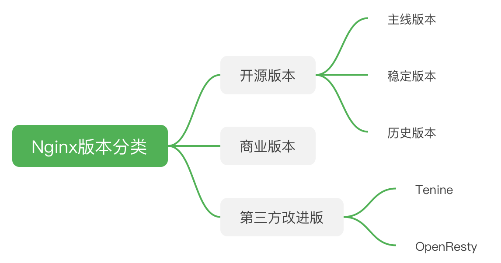
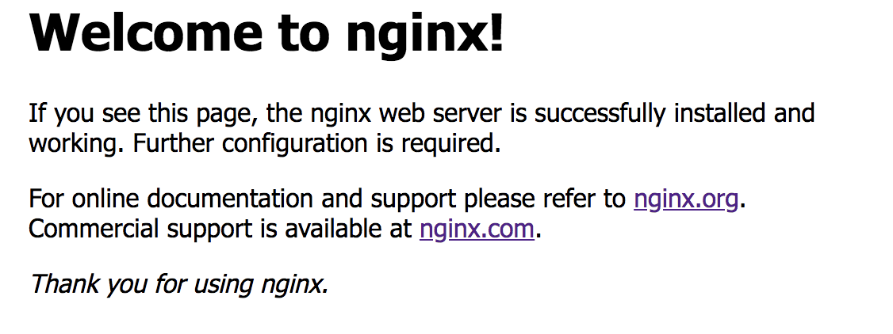

### 前言

本文是Nginx的第一篇文章，主要介绍如下功能：

- Nginx基本介绍
- Nginx版本介绍
- Nginx源码形式安装
- Nginx启动、重启、停止方式
- Nginx常用命令

### 一. Nginx基本简介

Nginx是一个高性能的HTTP和反向代理web服务器，同时也提供了IMAP/POP3/SMTP服务，不过我们主要是用作服务器。Nginx因为其稳定性、丰富的功能集、示例配置、低资源消耗、并发能力强而闻名。

主要功能：

- HTTP服务器
- 负载均衡
- 反向代理
- 正向代理
- 邮件服务器

优点：

- 使用简单
- 高扩展
- 高可用
- 低资源消耗
- 高并发


### 二. Nginx版本介绍

Nginx有两个大方向，开源版本和商业版本，网站分别为：

- 开源版本：www.nginx.org
- 商业版本：www.nginx.com

我们主要学习开源版本，在开源版本中，分为三种类型的版本：

- Mainline version：主线版本或者开发版本，是目前最新的版本，但没有经过严谨的测试，不太稳定，一般不会使用到生产环境中。
- Stabel version：稳定版本，经过官方测试通过的相对比较稳定的版本，可以在生产环境中使用。
- Legacy version：历史版本，之前的稳定版本，不需要Nginx最新的特性也可以在生产中使用。

除了官方的这些版本，还有一些第三方在基于Nginx的基础上修改的版本，比如淘宝开发的Tengine，还要OpenResty。Tengine有许多方便的功能，比如对后端服务进行检测。OpenRestry是集成Nginx和Lua的高性能web平台，集成了大量的Lua库，特别是在需要使用Lua来进行扩展Nginx的时候，特别方便。有兴趣的可以了解一下上面两个。




### 三. Nginx安装

Nginx有win和Linux版本，由于Nginx主要是部署到服务器上，所以这里以Linux的安装方式为主，win版本的有兴趣可以自行了解。

Linux版本的安装主要是两种方式：系统安装和编译安装。

系统安装：如果是Ubuntu系统，使用apt-get，如果是Centos，使用yum,这种方式的优点就是方便，会将Nginx常用的一些模块一起安装，比如ssl、gzip等，但不包含在其中的模块则没有。

编译安装：相对比较麻烦，但优点就是我们可以自行选择需要安装的模块。

这里主要是使用编译安装的方式，方便以后扩展其他的模块。

#### 1. 下载安装包

在官网选择合适的版本下载，地址为：
```
http://nginx.org/en/download.html
```
这里下载的版本是1.18.0。

#### 2. 解压安装包

首先我这儿先创建一个名为nginx-source的文件，用于下载的压缩包以及解压后的文件，主要是方便以后增加模块的时候还能找到源文件进行编译。

```
root@amdin1:~# cd /usr/local
root@amdin1:/usr/local# mkdir nginx-source
root@amdin1:/usr/local# cd nginx-source/
```
然后将压缩包移动到该目录下，解压：

```
root@amdin1:/usr/local/nginx-source# tar -zxvf nginx-1.18.0.tar.gz 

```

进入解压后的目录先看一下：

```
root@amdin1:/usr/local/nginx-source# cd nginx-1.18.0
root@amdin1:/usr/local/nginx-source/nginx-1.18.0# ls
auto  CHANGES  CHANGES.ru  conf  configure  contrib  html  LICENSE  man  README  src

```

介绍一下相关的目录：

- CHANGES：当前版本修复的bug、改动、新增的功能等描述。
- CHANGES.ru：俄语版本的changes。
- conf：nginx的配置文件模板
- configure：进行编译安装的一些配置脚本。
- contrib：提供vim中语法高亮功能。
- html：静态文件
- man：帮助文档
- src：源代码目录


#### 3. 编译

首先通过configure设置配置选项，使用./configure --help可以查看可以设置的配置选项，其中--prefix指定Nginx安装的目录，--with-XXX的是需要加入指定的模块。--without-XXX则可以移除指定的模块。

执行下面的命令，将Nginx安装到/usr/local/nginx中，并新增ssl等模块。

```
root@amdin1:/usr/local/nginx-source/nginx-1.18.0# ./configure --prefix=/usr/local/nginx --with-http_ssl_module --with-stream --with-mail=dynamic

```
有可能会出现如下的错误，是因为在安装模块的时候需要其他的依赖包，具体需要依赖哪些模块包可以看错误描述。

```
./configure: error: the HTTP rewrite module requires the PCRE library.
You can either disable the module by using --without-http_rewrite_module
option, or install the PCRE library into the system, or build the PCRE library
statically from the source with nginx by using --with-pcre=<path> option.
```

我在安装的时候加上如下两个依赖就可以，具体还是看报错：
```
sudo apt-get install openssl libssl-dev
sudo apt-get install libpcre3 libpcre3-dev
```

如果没有报错了，执行make：

```
root@amdin1:/usr/local/nginx-source/nginx-1.18.0# make
```

执行成功后会在目录下产生一个objs目录，主要是后边做nginx升级或者新增模块的时候需要用到，里面有一个nginx执行文件。

没有报错后继续执行make install：

```
root@amdin1:/usr/local/nginx/logs# make install
```
然后进入/usr/local,会看到有一个nginx文件夹，这个就是编译后的nginx存放地方。

进入后有如下信息：

```
root@amdin1:/usr/local# cd nginx
root@amdin1:/usr/local/nginx# ls
conf  html  logs  modules  sbin

```

#### 4.启动验证

进入sbin中执行nginx：

```
root@amdin1:/usr/local/nginx/sbin# ./nginx 
```

从浏览器访问,我这里是虚拟机安装的，访问路径为192.168.15.136，出现如下界面，则安装成功：




### 四. Nginx启动、重启、关闭

#### 1. 启动：

```
/usr/local/nginx/sbin/nginx

```

#### 2. 重启：

```
/usr/local/nginx/sbin/nginx -s reload
```
或者使用信号量

```
kill -HUP nginx主进程号
```

#### 3. 停止：

````
/usr/local/nginx/sbin/nginx -s stop
````
或者使用信号量：

平滑停止，等待所有请求处理结束后关闭服务：
```
kill -QUIT nginx主进程号
```

立刻关闭Nginx进程：

```
kill -TERM nginx主进程号
```
或者直接使用 kill -9：

```
kill -9 nginx主进程号
```

### 五. Nginx常用命令

二进制编译安装的Nginx不会自动将可执行的命令加入系统变量，需要手动添加在.profile文件中：

```
PATH="/usr/local/nginx/sbin":$PATH
export path

```

然后让配置文件重新生效：

```
source .profile
```

之后就可以直接使用nginx命令，而不需要必须进入sbin目录。


- -h 、-？：查看帮助命令

```
admin1@amdin1:~$ nginx -h
nginx version: nginx/1.18.0
Usage: nginx [-?hvVtTq] [-s signal] [-c filename] [-p prefix] [-g directives]

Options:
  -?,-h         : this help
  -v            : show version and exit
  -V            : show version and configure options then exit
  -t            : test configuration and exit
  -T            : test configuration, dump it and exit
  -q            : suppress non-error messages during configuration testing
  -s signal     : send signal to a master process: stop, quit, reopen, reload
  -p prefix     : set prefix path (default: /usr/local/nginx/)
  -c filename   : set configuration file (default: conf/nginx.conf)
  -g directives : set global directives out of configuration file

```

- -v：查看Nginx版本

```
admin1@amdin1:~$ nginx -v
nginx version: nginx/1.18.0

```
- -V：除了可以查看Nginx的版本，还可以查看之前我们编译的时候的编译选项

```
admin1@amdin1:~$ nginx -V
nginx version: nginx/1.18.0
built by gcc 5.4.0 20160609 (Ubuntu 5.4.0-6ubuntu1~16.04.1) 
built with OpenSSL 1.0.2g  1 Mar 2016
TLS SNI support enabled
configure arguments: --prefix=/usr/local/nginx --with-http_ssl_module --with-stream --with-mail=dynamic

```

- -t：检查启动的时候的nginx.conf文件是否存在语法错误
- -c：指定Nginx启动的时候的配置文件，默认是编译后安装目录下的conf/nginx.conf文件
- -s: 向正在运行的Nginx主进程发送信号量，包括 reload、stop、quit、reopen。