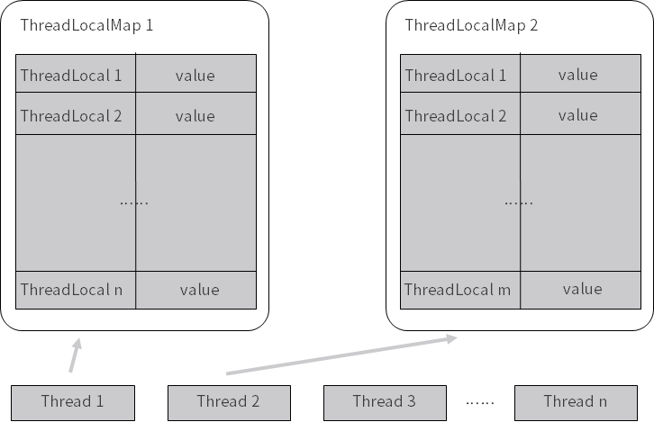

#### 1. ThreadLocal的作用是什么？

- 解决变量的线程安全问题：ThreadLocal会为每个线程创建变量的一个副本，该副本只能有该线程进行修改和访问，其他的线程不能对该变量进行操作。

- 解决线程中方法之间传参问题：当线程中方法之间需要传递参数的时候，可以通过入参的形式解决，同样也可以使用ThreadLocal来存放参数。

ThreadLocal其实不是解决共享变量线程安全的问题，而是将变量私有化，不让其他线程访问，从而达到线程安全的目的。

#### 2. ThreadLocal和Synchronized的区别是什么？

- ThreadLocal是采用副本的方式保证线程安全，Synchronized是通过加锁的方式保证线程安全。
- ThreadLocal还可以用作方法间数据传输

#### 3. ThreadLocal的实现原理是什么？




首先需要理解ThreadLocal、Thread的关系，在Thread中有一个变量threadLocals，这是一个ThreadLocalMap。ThreadLocalMap可以看做是一个Map，其中的key就是ThreadLocal，Value就是ThreadLocal中保存的变量。

根据上面的图，我们根据一个线程，就可以获取到该线程中定义的所有的ThreadLocal， 进一步能够找到保存的变量的值。


Thread中定义的ThreadLocalMap变量：

```
ThreadLocal.ThreadLocalMap threadLocals = null;
```

ThreadLocal的get()方法：

```
 public T get() {
        Thread t = Thread.currentThread();
        ThreadLocalMap map = getMap(t);
        if (map != null) {
            ThreadLocalMap.Entry e = map.getEntry(this);
            if (e != null) {
                @SuppressWarnings("unchecked")
                T result = (T)e.value;
                return result;
            }
        }
        return setInitialValue();
    }
```

get()方法的大致思想是：先根据当前的线程获取到线程的ThreadLocalMap，再根据当前的ThreadLocal引用获取到对应的值，返回保存的变量信息。如果ThreadLocalMap或者Value不存在的话，就会初始化Value的值。

```
 private T setInitialValue() {
        T value = initialValue();
        Thread t = Thread.currentThread();
        ThreadLocalMap map = getMap(t);
        if (map != null)
            map.set(this, value);
        else
            createMap(t, value);
        return value;
    }
```

初始化Value的逻辑大致为：先调用initialValue()方法获取初始化的值，这个方法是可以在创建ThreadLocal的时候重写的，如果使用默认的就返回null。然后根据当前线程获取ThreadLocalMap，并将当前的ThreadLocal和初始化的值插入。如果没有ThreadLocalMap，则会创建一个。

set()方法：

```
  public void set(T value) {
        Thread t = Thread.currentThread();
        ThreadLocalMap map = getMap(t);
        if (map != null)
            map.set(this, value);
        else
            createMap(t, value);
    }
```

set()方法大致思想为：获取当前线程的ThreadLocalMap，然后将当前的ThreadLocal作为key，需要保存的数据为value保存到map中。如果没有ThreadLocalMap的时候会创建一个。

#### 4. ThreadLocal中的内存泄漏问题

- 解决Key内存泄露的方法

当创建的ThreadLocal对象使用完后，我们会将其设置为null，想要垃圾收集器将对象的内存进行回收，但此时TheadLocalMap中的key还直接指向ThreadLocal对象，此时，ThreadLocal就不会被垃圾回收，造成内存泄露。

为了解决上面的问题，ThreadLocal中在定义Entry的时候，使用了弱引用来修饰Key。当ThreadLocal对象的引用被设置为null后，只会存在ThreadLocalMap中的key对其引用，而这个引用是弱引用，所以当进行垃圾回收的时候就会ThreadLocal对象进行回收。

```
static class Entry extends WeakReference<ThreadLocal<?>> {

    Object value;

    Entry(ThreadLocal<?> k, Object v) {
        super(k);
        value = v;
    }
}
```

- 解决value内存泄露的方法
 
ThreadLocalMap中的value是被强引用的，只有当线程执行完毕后才会将其回收，但如果线程持续的时间比较长，但ThreadLocal很早就不需要使用的时候，就存在内存泄露问题。


看上面这张图的下面一部分调用链，当线程一直存在的时候，value就可能造成内存泄露。

解决的方法是当我们使用完ThreadLocal后，需要手动调用remove()方法，将value从ThreadLocalMap中移除。

```
public void remove() {

    ThreadLocalMap m = getMap(Thread.currentThread());

    if (m != null)
        m.remove(this);
}
```


